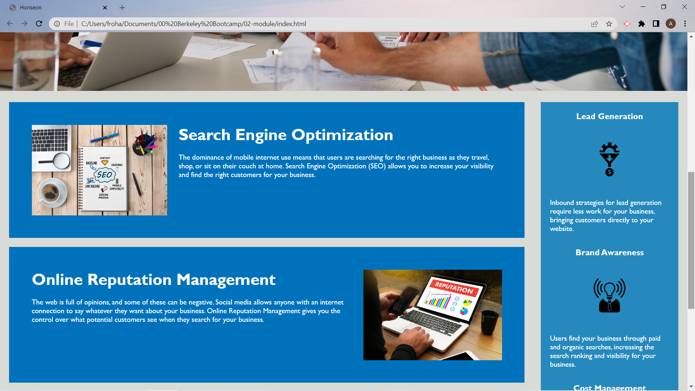
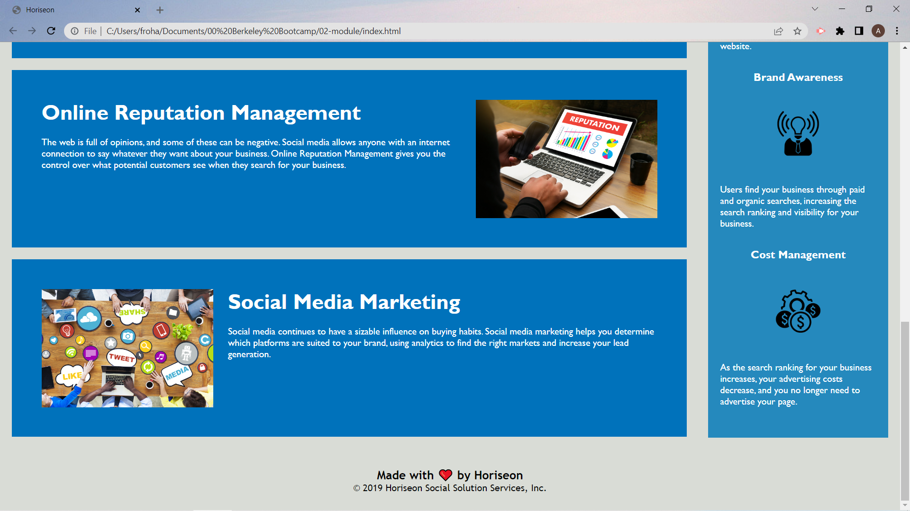

Acceptance Criteria:
```
GIVEN a webpage meets accessibility standards
WHEN I view the source code
THEN I find semantic HTML elements
WHEN I view the structure of the HTML elements
THEN I find that the elements follow a logical structure independent of styling and positioning
WHEN I view the image elements
THEN I find accessible alt attributes
WHEN I view the heading attributes
THEN they fall in sequential order
WHEN I view the title element
THEN I find a concise, descriptive title
```

EDITS:
```
Removed unnecessary spaces and slashes from header

Changed title to "Horiseon"

Added href link to "Horiseon" title

Removed unnecessary spaces and slashes from body

Added 'id' element to the "search-engine-optimaiztion" div in 'content' section

Added alt attributes to all images

Changed divs to header, sections, aside, footer
```
Screenshots:






Link to GitHub repository:
https://github.com/704abe/Horiseon-webpage

Link to deployed webpage:
https://704abe.github.io/Horiseon-webpage/
